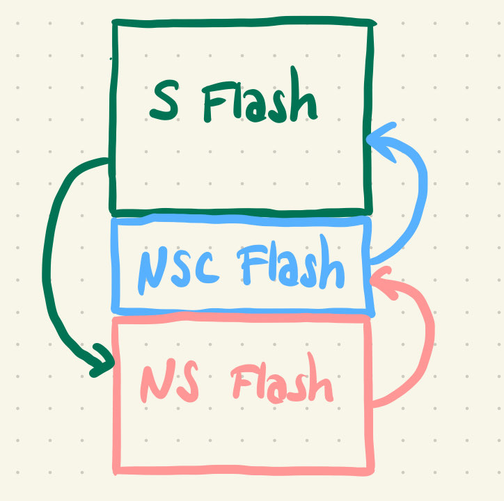

+++
title = "Exploring TrustZone-M on the nRF9160"
date = 2024-06-09
[taxonomies]
tags = ["arm", "trustzone-m", "tz-m", "nordic", "nrf9160", "learning"]
categories = ["programming"]

[extra]
cover_image="nRF9160.jpeg"
+++

I am working with the IoT operating system [RIOT-OS](https://www.riot-os.org/) and have been developing some cryptography features for it.
For my master thesis I'm exploring Trusted Execution Environments (TEE) for RIOT and how to integrate them with the OS.
Newer Arm Cortex-M devices with the Armv8-m architecture offer a hardware security mechanism called TrustZone-M (TZ-M), that can be used to efficiently implement secure processing environments.
One platform with TZ-M that is also supported by RIOT is the Nordic nRF9160dk, which I am using for a PoC for my thesis.
To understand how TZ-M works and what is needed to use it, I started looking for a nice, minimal bare-metal example with simple secure and non-secure images and a simple linker file.
Finding such an example for Nordic boards was surprisingly difficult, so I assembled all the information and code snippets I could get and build my own little project, which I now [share on Github](https://github.com/Einhornhool/minimal-tz/).
In this blog post I'll explain how I collected that information and what I did to get it running eventually.

<!-- more -->

> **I assume you know**
> - what the Arm TrustZone is ([here's a good paper](https://sandro2pinto.github.io/files/acmcsur2019-tz.pdf))
> - how to program and flash a microcontroller
> - how to write and read C language
> - what makefiles and linkerfiles are

## Finding a Starting Point
My goal for this project was to write a very small application that utilizes the TrustZone-M technology.
So of course I opened the big bad search engine and typed `Nordic nRF9160 bare-metal example`.
I quickly learned that, while bare-metal programming Nordic boards is possible, the vendor does not offer any help for people who want to try it.
Questions on the forum are usually answered with something along the lines of "Please use our SDK and/or Zephyr OS".
This might be fine for people who just want to use the boards for some project and don't care much about making choices in terms developing environments.
But it really sucks if you want to do your own thing.

Luckily there are a small number of people who ignore this and who provided helpful code examples on the forums.
The first one I found was [this](https://devzone.nordicsemi.com/f/nordic-q-a/92877/bare-metal-programming-on-the-nrf9160), which is just a simple application that turns LEDs on and off.
This consists of just one `main` function and a Makefile and does not use the TrustZone at all.

The second one was [this](https://devzone.nordicsemi.com/f/nordic-q-a/96093/nrf9160-porting-the-modem-library-to-work-with-bare-metal-application) example, which consists of a secure bootloader and a non-secure application.
This is one step closer to what I need, but still not exactly the right thing.
The makefile of this app produces two binaries: a bootloader image and a non-secure app.
The bootloader configures secure and non-secure memory regions and then starts the non-secure app.
All operations are then performed on the non-secure side without ever calling secure functions.
My goal is to actually have a secure and non-secure image running side-by-side and have the non-secure side call some functions provided by the secure side.

This example also provides two very simple linker scripts for the two images, which is great, because linker scripts are one of the things I still struggle with.

These two projects are what I base my minimal project on.

## Extending the Code
The next step was to find out what I needed to to.
Of course I had the nRF9160 reference manual, the Armv8-M reference manual and some other documentation and blog posts from Arm.
I've also previously ported [Trusted Firmware-M (TF-M)](https://trustedfirmware-m.readthedocs.io/en/latest/index.html) to RIOT, which already helped in getting an idea of what a secure application could look like and what is needed to build and run two different images on a board.
But reference manuals are mostly theoretical and TF-M is quite bloated and complex, which makes it hard to comprehend.
Some more googling lead me to a [basic TrustZone example from Microchip](https://microchip-mplab-harmony.github.io/csp_apps_sam_l10_l11/apps/trustZone/trustZone_basic/readme.html) and this [pretty cool blog post](https://m10.io/blog/highway-to-the-trustzone) about a Rust example for the nRF5340.
Both resources were very helpful in figuring out the necessary steps.

So here's what I did:


### The Secure Side
#### Non-Secure Entry (NSE) Functions

For communication between the two images we need some NSE functions, also called **secure gates**.
Those are *veneer* functions, which will placed in a special memory region that can be called from the non-secure side and will trigger the transition to the secure state to perform a secure execution (more on this later).
I wanted to keep this as simple as possible, so I wrote three functions to configure and toggle the four LEDs that are soldered to the nRF9160dk board.
As you can see below, the functions access the secure address of the GPIO pins (defined as `NRF_P0_S`).
The C-file below includes the `arm_cmse.h` header file (*CMSE* means *Cortex-M Security Extension*), which is part of the Arm GNU Toolchain (link can be found in the code repository) and is needed to define secure entry functions and to implement secure software.
I then gave the functions the attribute `cmse_nonsecure_entry`, so the compiler will know that they are and will treat them accordingly.

```c,linenos
#include <arm_cmse.h>
#include "nrfx.h"

void __attribute__((cmse_nonsecure_entry)) config_leds(void)
{
    NRF_P0_S->DIRSET |= (1<<5) | (1<<4) | (1<<3) | (1<<2);
}

void __attribute__((cmse_nonsecure_entry)) led_on(int offset)
{
    NRF_P0_S->OUTSET |= 1<<(offset+2);
}

void __attribute__((cmse_nonsecure_entry)) led_off(int offset)
{
    NRF_P0_S->OUTCLR |= 1<<(offset+2);
}
```

#### The Linker Script
The NSE functions need to be implemented on the secure side, but also linked with the non-secure side.
For this they get their very own memory region: The **non-secure-callable (NSC)** region is placed at the very end of the secure flash region and needs to be added to the secure linker file.
The excerpt below shows that the secure flash region starts at address 0x0 and is 64KB large.
The NSC region has a size of 32 Bytes (which is the minimal possible size) and is placed at the end of the 64K.

```linenos
_flash_start = 0x0;
_flash_len = 64K;

_flash_nsc_len = 32;
_flash_nsc_start = _flash_len - _flash_nsc_len;

_ram_start = 0x20000000;
_ram_len = 0x10000;

MEMORY
{
  FLASH (rx) : ORIGIN = _flash_start, LENGTH = _flash_len
  FLASH_NSC (rx) : ORIGIN = _flash_nsc_start, LENGTH = _flash_nsc_len
  RAM (rwx) : ORIGIN = _ram_start, LENGTH = _ram_len
}
```


Next we need to declare a memory section called `.gnu.stubs`, which the linker is going to place the NSC functions in.
We can easily do this at the bottom of our linker script.

```
SECTIONS
{
  .gnu.sgstubs : ALIGN (32)
  {
      . = ALIGN(32);
      *(.gnu.sgstubs*)
      . = ALIGN(32);
  } > FLASH_NSC
}
```

#### Configuring Memory Regions
When running a secure and non-secure image together, the secure image needs to configure memory regions at runtime.
In our application we just do this in the secure main function.
The example below shows the part of the function where the NSC region is configured (flash and RAM configurations can be viewed in the code repository).

```c,linenos
    int flash_nsc_id = 0;
    int flash_region = 1;

    NRF_SPU_S->FLASHNSC[flash_nsc_id].REGION = flash_region;
    NRF_SPU_S->FLASHNSC[flash_nsc_id].SIZE = NRF_SPU_NSC_SIZE_32B;
```
As explained before, the NSC region is located at the end of the secure flash.
We need to define the flash region it is going to be placed in and pass the size of the NSC region.
This needs to be consistent with what we wrote in the linker file.

We could have two NSC regions, so `flash_nsc_id` can be either 0 or 1.
Since we only have one NSC region, our ID is 0, of course.

Flash on the nRF9160 is separated into 32 regions which have a size of 32 Kilobyte each.
We configured the first 64KB as secure (regions 0 and 1), so we're placing the NSC region at the end of flash region 1.
Since we only have three small functions, we can use the minimum NSC size, which is 32 Byte (`NRF_SPU_NSC_SIZE_32B` is defined in `nrf_spu.h`, which is part of the NRFX library included in this project).

### The Non-Secure Side
The non-secure side is quite easy.
It should not be aware of the secure image and "think" that it's the only application running on the system, so we can implement it like any other C-program.
There are only two things to consider:
1. The NSE functions need to be declared somewhere to make them available to our code (I added the `ns_entry.h` file).
2. The non-secure linker script needs to define flash and RAM starting addresses after the secure flash and RAM regions.

### Building and Linking
When building the secure image, we need to add the compiler flag `-mcmse`.
The compiler will now automatically build two parts of the NSE functions.
The actual function body will be placed in the `.text` section of secure flash.
The `.gnu.sgstubs` section we declared above will contain a so-called secure gateway (SG) instruction, which will trigger the transition to the secure state and from there jump into the actual secure code.

Next we need to add `--cmse-implib` and `--out-implib=nsclib.o` to the secure linker flags.
This will generate an object file that can be linked with the non-secure binary to make the NSE functions available.

After this it is possible to merge the images and flash them to the board.

## Sources
- [Bare-metal Blinky example](https://devzone.nordicsemi.com/f/nordic-q-a/92877/bare-metal-programming-on-the-nrf9160)
- [Bare-metal example with bootloader](https://devzone.nordicsemi.com/f/nordic-q-a/96093/nrf9160-porting-the-modem-library-to-work-with-bare-metal-application)
- [Arm®v8-M Architecture Reference Manual](https://developer.arm.com/documentation/ddi0553/latest/)
- [nRF9160 Reference Manual](https://infocenter.nordicsemi.com/pdf/nRF9160_PS_v1.0.pdf)
- [TrustZone-M with Rust](https://m10.io/blog/highway-to-the-trustzone)
- [Microchip TrustZone-M example for SAML11](https://microchip-mplab-harmony.github.io/csp_apps_sam_l10_l11/apps/trustZone/trustZone_basic/readme.html)
